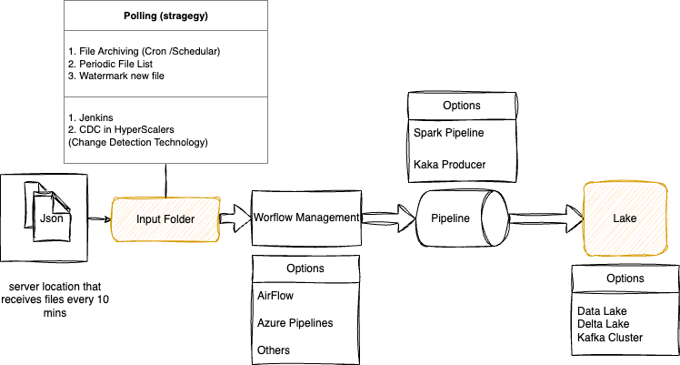

# Data Engineering Challenge

## Goal
- Code to ingest **data daily**
- In **proper structure**.

## Framework : Pyspark
Used  to ingest the Data for below advantages
- MultiCore  Parallel Processing Capablity .
- InMemory
- Fault Tolerance 
- High Level API and SQL 
- Ease of Use 

## Project Structure 
- DataLake : Store Data post processing
    - raw : Extract - Load as parquet
    - ez (future ) : To Store Cleaned Data / Transformed Data / Build Data Warehouse 

- searches: Input files for searches are dropped here 
- visitors: Input files for visitors are dropped here 
- archive : Once Data is processed , input files are archived here
    - searches: Input files from searches are moved here
    - visitors: Input files from visitors are moved here

- sparkCache: Store Spark Cache Data
- python : Source Code  

#  Source Code Folder (python)
1. Assignment.py / Assignment.ipynb :
    - Both are main files .
    - Both have same code , use can use either based on conviencince .
    - Assignment.py is created specifiacally for running in container ( but nonethless can be used run locally ).
2. config.py
    - Dataclass
3. util.py 
    - helper functions

## How to Run

### Pre-Req:
1. python is installed
2. pyspark is configured 

### steps:
1. Extract the zip Folder
2. cd into the Folder extracted
3. add relavent files to be ingested into seaches and visitors folders
4. run python/Assignment.py or Assignment.ipynb 

## Architecture 

--------------------
## Task 1: Data Ingestion
1. Read all files that are given in this assignment 
2. Based on the timestamp of each file's name
3. Ingest into the datalake
4. Pipeline could be accidentally triggered multiple times in a day

### Solution Implemented :
I have implemented a logic mechanism to relocate JSON files to an archive folder upon completion of processing. This precautionary measure is designed to mitigate potential issues that may arise from unintentional execution of the pipeline.

1. With the above logic the data is inherently saved with timestamps and inherently partitioned. Consequently, this minimizes data skewness while further processing in spark
2. Following the ingestion of input files, the files archived, there is no risk of false triggers or unintended modifications.
3. The archived data serves as a reliable backup and can be retained or purged as required, aligning with specific operational needs.
4. There is no need to have additional overhead like WaterMarking / Code Complexity to overcome this challenge.
5. Above logic is Simple and Reliable.

#### Format Used : parquet
1. Retaining the data structure and type information is a key advantage of this approach.
2. Reduced storage requirements and improved processing efficiency.
3. When setting the compression "snappy," which offers rapid compression and decompression capabilities.
4. ultimately enhancing data transfer and processing efficiency in distributed environments like Spark clusters.

### Output :
For input 

    visitor-part-01-2020123.json
    visitor-part-02-2020123.json
Are Stored in same Folder 

    Datalake/raw/2020123/xxx1.parquet
    Datalake/raw/2020123/xxx2.parquet

--------------------
## Task 2: Preprocessing

1. Consume Data from Lake
2. changes you will perform,
3. why 
4. which format and structure 
5. optimize and increase the performance. 

### Solution Implemented 
1. Given that data is partitioned for consumption, it should be evenly distributed among each Spark Executor.
2. In order to minimize multiple reads, the data is cached during the initial reading process, and subsequently cleared after cleansing.
3. As per the specifications, we require the following fields from the visitor table: visitor_id, date, region, and country.
4. From the searches table, we need date and visitor_id.
5. Among the available columns, visitor_id and date_time hold the utmost significance.
6. Furthermore, "visitor_id" and "date" is regarded as a dimension.
     - (Assumption) Typically, visitor_id is auto-generated and finite in nature.
     - maintains uniqueness, and remains static.
     - It is a common attribute shared by both tables.
     - It serves as a key for performing joins.
     - When natural numbers are used Increases performance because of faster searches 
     - This can be considered as a LAD or Early Arriving Fact (for future Development)

7. Considering the substantial size of our dataset, it is imperative to persist intermediate results for optimal performance.
8. Since our data can be quite extensive, caching it in memory might lead to overflow issues. Therefore, implementing a Checkpoint is advisable.
9. It is important to note that while region and country have been considered as dimensions, they have not been implemented due to their minimal impact on performance. However, they may be considered for future development.

#### **visitor_id ( Dimension )**
1. Convert the data to a string format and subsequently apply a trimming process.
2. Address and rectify any occurrences of null values within the dataset.
3. Create a series of natural numbers that serve as unique keys for each distinct visitor_id.
4. Employ these unique keys as the primary means of joining datasets, as this optimization streamlines subsequent operations.
5. It is advisable to cache this dataset for the purpose of enhancing operational efficiency in future processes.
6. RePartitioning visitor dimension, despite its initial performance degradation, is a one-time process that ultimately yields better performance in the long run .

#### **date_time ( Period Dimension )**
1. Standardize the format in both tables to ensure consistency.
2. Generate a  date column, exclusively containing "date" values, derived from the date_time attribute.
3. Generate a new table for the date column along with Skeys.
3. RePartitioning period dimension, despite its initial performance degradation, is a one-time process that ultimately yields better performance in the long run .

------------------------------
## Task3: Reports

Utilizing the key generated in the preceding step, the two datasets are merged and subsequently grouped in order to derive the specified results.By employing the dimension table, end users can attain the desired outcomes.

------------------------------
## Task4: Pipeline architecture

1. Multiple large datasets every 10 minutes, 
2. How do you automatize this task
3. Which tools
4. which strategy would you use? 
    -  a simple architecture
    - infrastructure of your desired system.

### Design 1 : Cron Job for Folder Polling:
#### Tools : Cron Job (Schdeular) , Spark , Lake 
1. Implement a cron job scheduler to regularly poll the folders in consideration, as specified every 10 minutes using above logic.
2. Ensure that the cron job is configured to handle any potential failures gracefully, with proper logging and alerting mechanisms in place.
3. As Spark is executed in Cluster mode, extensive performance optimizations can be done in cluster like data locality , Speculation , Resource Scheduling etc., 
4. Additionally, the Spark cluster can be vertically scaled by augmenting hardware resources and horizontally scaled by expanding the number of worker nodes.

### Design 2
#### Tools : Orchestartion Tool , AirFlow DAG ,Spark Cluster

File Monitoring and Jenkins Integration: 
1. Jenkins can be configured to use webhooks, polling, or other mechanisms to detect changes.
2. Implement a script within Jenkins that checks for newly added files 
3. Each time a change is detected , it triggers Aitflow

Airflow DAG for Workflow Orchestration:
1.  Create an Airflow DAG specifically for the data warehouse pipeline. 
2. This DAG should consist of multiple tasks that represent different stages of data processing. 

### Design 3
#### Tools : Consuming from Kafka Cluster   
Methods to pool Folder for Kafka : 
1. Periodic Directory Listing:
Periodically list the contents of the folder you are monitoring (e.g., every few seconds or minutes).Compare the current list of files with the previous list obtained during the previous iteration.
2. Last FileTimestamp Method : Track of the last modification timestamp last file coming into the folder 
3. Since the input is already in JSON format , there is no overhead of converting to serializable format making it suitbale candidate .

## Running using a Docker Container
### Steps: 
1. Extract the zip folder locally
2. In the root directory there are 3 folders :
    - python :
    - searches :
    - visitors :
3. Add relavent json files for Ingestion in searches and visitors 
4. Run below commands :

        docker build -t assignment:v1 .
        docker run -p 4040:4040 assignment:v1 driver python/Assignment.py

        #WebUI - localhost:4040

**Execution Results Of Partial DataSet**
   

